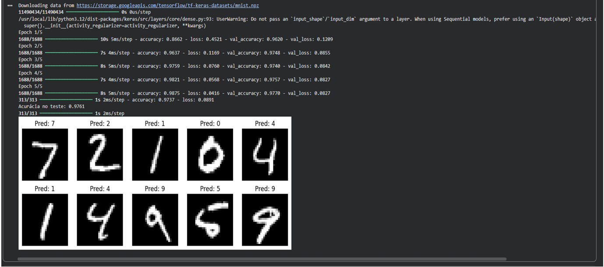

# Classificação de Dígitos com Rede Neural (MNIST)

## Objetivo
Desenvolver um modelo de rede neural para classificar imagens de dígitos manuscritos utilizando o dataset MNIST.

## Problema
Aplicar conceitos introdutórios de machine learning e redes neurais em um problema clássico de classificação de imagens.

## Ferramentas utilizadas
- Python
- TensorFlow
- Keras
- Matplotlib

## Etapas do projeto
1. Carregamento do dataset MNIST
2. Normalização das imagens
3. Redimensionamento dos dados
4. Construção da rede neural
5. Treinamento do modelo
6. Avaliação da acurácia
7. Visualização das previsões

## Resultados
O modelo foi treinado para classificar imagens de dígitos manuscritos e apresentou boa capacidade de predição no conjunto de teste.

## Arquivos do projeto
- Código Python do modelo
- Imagem com exemplos de previsões
- Relatório da atividade

## Resultado do modelo

Exemplo de previsões da rede neural para dígitos do dataset MNIST.

## Autor
Gustavo Vitor Santos da Gama
